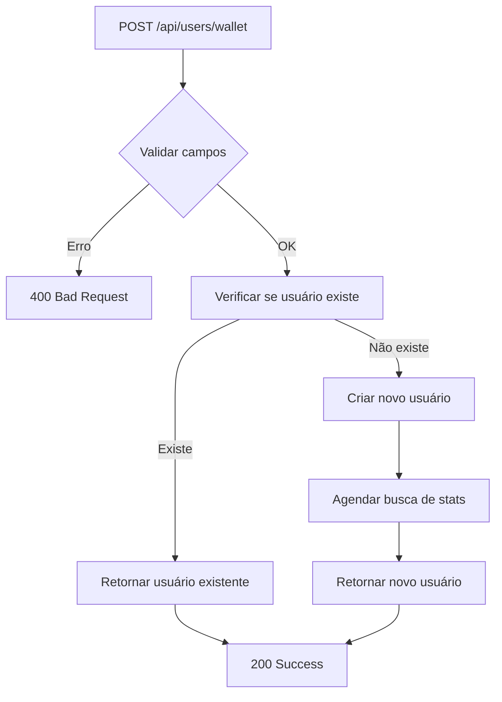

# Tratamento de Usuários Duplicados

## ✅ Alterações Implementadas

A API foi modificada para permitir usernames duplicados e retornar sucesso quando um usuário já existe, em vez de erro.

## 🔧 Mudanças Realizadas

### 1. **Schema do Banco de Dados**
- ✅ **Removido**: Restrição `UNIQUE` do campo `username`
- ✅ **Mantido**: Username ainda é obrigatório (`NOT NULL`)

```sql
-- ANTES
username VARCHAR(255) UNIQUE NOT NULL,

-- DEPOIS  
username VARCHAR(255) NOT NULL,
```

### 2. **UserService**
- ✅ **Adicionado**: Método `getUserByUsernameAndWallet()`
- ✅ **Funcionalidade**: Busca usuário pela combinação username + wallet

```typescript
static async getUserByUsernameAndWallet(username: string, walletAddress: string): Promise<User | null>
```

### 3. **UserController**
- ✅ **Verificação**: Checa se usuário já existe antes de criar
- ✅ **Retorno**: Sempre retorna sucesso, mesmo para usuários existentes
- ✅ **Flag**: Adiciona campo `existing` na resposta

## 🚀 Comportamento Atual

### **Cenário 1: Usuário Novo**
```bash
POST /api/users/wallet
{
  "username": "novo_usuario",
  "wallet_address": "0x123..."
}
```

**Resposta:**
```json
{
  "success": true,
  "message": "User with wallet added successfully",
  "userId": 123,
  "wallet_address": "0x123...",
  "existing": false,
  "note": "Initial stats fetch scheduled"
}
```

### **Cenário 2: Usuário Existente**
```bash
POST /api/users/wallet
{
  "username": "usuario_existente",
  "wallet_address": "0x456..."
}
```

**Resposta:**
```json
{
  "success": true,
  "message": "User already exists",
  "userId": 456,
  "wallet_address": "0x456...",
  "existing": true
}
```

## 🔍 Lógica de Verificação

### **Critério de Duplicação**
Um usuário é considerado duplicado quando **ambos** os campos coincidem:
- ✅ `username` (mesmo nome)
- ✅ `wallet_address` (mesmo endereço de wallet)

### **Cenários Permitidos**
- ✅ Mesmo username, wallets diferentes → **Usuários diferentes**
- ✅ Usernames diferentes, mesma wallet → **Usuários diferentes**
- ✅ Mesmo username, mesma wallet → **Usuário duplicado (retorna existente)**

## 📊 Exemplos de Casos

| Username | Wallet | Resultado |
|----------|--------|-----------|
| `user1` | `0xAAA...` | ✅ Novo usuário |
| `user1` | `0xBBB...` | ✅ Novo usuário (wallet diferente) |
| `user2` | `0xAAA...` | ✅ Novo usuário (username diferente) |
| `user1` | `0xAAA...` | ✅ Usuário existente (retorna success) |

## 🔄 Fluxo de Execução



## 🧪 Como Testar

### **Teste 1: Criar usuário novo**
```bash
curl -X POST https://devrank-production.up.railway.app/api/users/wallet \
  -H "Content-Type: application/json" \
  -d '{
    "username": "test_user_1",
    "wallet_address": "0x1111111111111111111111111111111111111111"
  }'
```

### **Teste 2: Tentar criar o mesmo usuário novamente**
```bash
curl -X POST https://devrank-production.up.railway.app/api/users/wallet \
  -H "Content-Type: application/json" \
  -d '{
    "username": "test_user_1",
    "wallet_address": "0x1111111111111111111111111111111111111111"
  }'
```

### **Teste 3: Mesmo username, wallet diferente**
```bash
curl -X POST https://devrank-production.up.railway.app/api/users/wallet \
  -H "Content-Type: application/json" \
  -d '{
    "username": "test_user_1",
    "wallet_address": "0x2222222222222222222222222222222222222222"
  }'
```

## ✨ Vantagens

1. **✅ UX Melhorada**: Não há erro para usuários que tentam se registrar novamente
2. **✅ Idempotência**: Múltiplas chamadas com os mesmos dados têm o mesmo resultado
3. **✅ Flexibilidade**: Permite mesmo username com wallets diferentes
4. **✅ Robustez**: Sistema não quebra com tentativas de duplicação

## 📋 Logs

### **Usuário Novo**
```
User test_user added with wallet 0x123... and ID: 123
Initial stats fetch completed for user: test_user
```

### **Usuário Existente**
```
User test_user with wallet 0x123... already exists with ID: 123
```

## 🔒 Considerações de Segurança

- ✅ **Validação mantida**: Username e wallet ainda são obrigatórios
- ✅ **Identificação única**: Combinação username + wallet é única
- ✅ **Sem bypass**: Não é possível criar usuários inválidos

## 🚀 Impacto no Frontend

O frontend pode agora:
- ✅ **Chamar a API** sem se preocupar com duplicações
- ✅ **Verificar flag** `existing` para saber se é usuário novo ou existente
- ✅ **Sempre receber** `success: true` para casos válidos

A implementação está **completa e funcional**! 🎉
